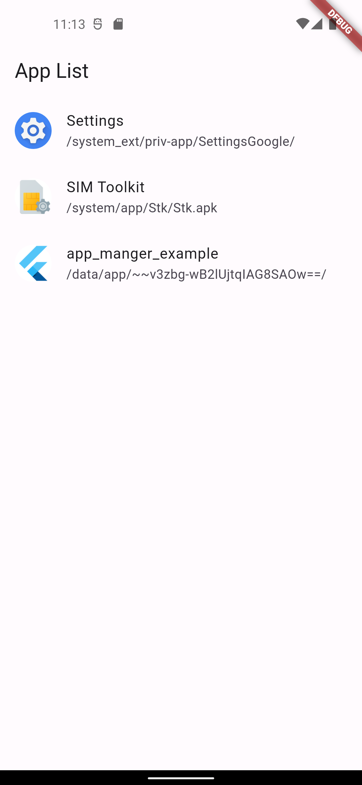
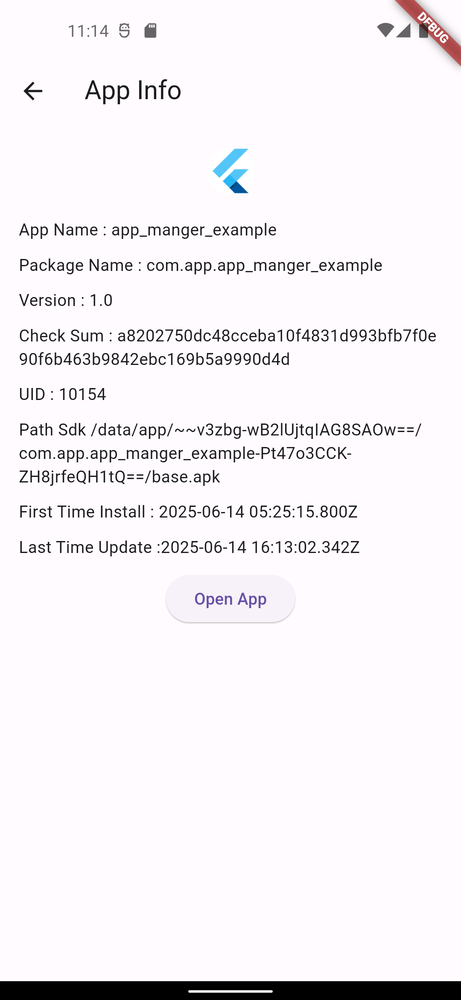

# App Manger Plugin

App Manger is a Flutter plugin that allows you to retrieve the list of all installed applications on Android devices and read detailed information about each app. It also supports launching other apps from your Flutter application.

## Features

- Retrieve a list of all installed applications on the device.
- Get detailed information about any app by its package name.
- Launch any installed app from Flutter.

## Installation

Add to your `pubspec.yaml`:

```yaml
dependencies:
  app_manger:
    git:
      url: https://github.com/nguyenhuuloc99/app_manger.git
```

Then run:

```
flutter pub get
```

## Usage

Import the plugin in your Dart file:

```dart
import 'package:app_manger/app_manger.dart';
```

### Get the list of installed apps

```dart
final apps = await AppManger.getListApp();
print(apps); // Returns a List<Map> with app information
```

### Get app information by package name

```dart
final appInfo = await AppManger.getAppInfo('com.example.app');
print(appInfo); // Returns a Map with app info or null if not found
```

### Launch an app by package name

```dart
await AppManger.launchApp('com.example.app');
```

## Screenshot

<p align="center">
  
  
</p>

## Requirements

- Android only.
- May require permissions to access app information.

## Contribution

Feel free to open an issue or pull request if you want to contribute to this plugin.

---

**Note:** Replace the Git URL in the installation section with your actual repository link.